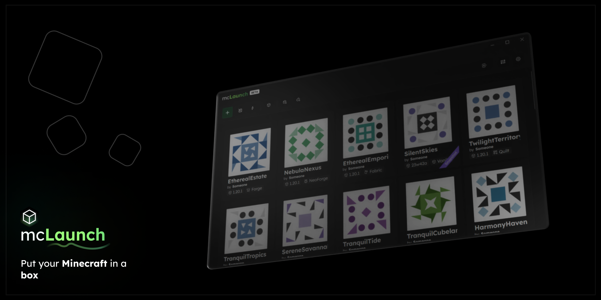

> This project is in a very early stage, some things just don't work or aren't implemented yet !

<h3 align="center">mcLaunch</h3>

<p align="center">The Minecraft launcher that puts your Minecraft in a box 📦</p>

**mcLaunch** (pronounced **m-c-launch**, **[ɛm si lɔntʃ]**) is a new and modern Minecraft launcher focused on design, compatibility, and ease of use.




# Features

+ Launches every Minecraft version 🚀
+ Supports Fabric, Forge and Quilt 📜
+ Installs mods, and import modpacks from both CurseForge and Modrinth 🧩
+ Exports modpacks to a custom really small file format 🛫

# Install

## Windows x64
Download the installer [here](https://github.com/CacahueteSansSel/mcLaunch/releases/download/v0.1.1/mcLaunch.Installer.win64.exe) and follow the instructions. If you have any warning about "Windows protected your PC", ignore it. If you don't want to use the installer, download `mcLaunch-windows.zip` from [the latest release](https://github.com/CacahueteSansSel/mcLaunch/releases/latest), extract it in a folder, and run mcLaunch.exe from there.

## Linux x64
Download `mcLaunch-linux.zip` from [the latest release](https://github.com/CacahueteSansSel/mcLaunch/releases/latest) and extract it in a folder. You may need to mark the `mcLaunch` and the `mcLaunch.MinecraftGuard` files as executable before running mcLaunch.

# Build

Make sure to have the **.NET 6.0 SDK** (.NET 7 does not work anymore) installed, then clone the project.

## Set your own credentials keys

mcLaunch needs to have credentials keys for communicating with CurseForge, logging in via Microsoft, and encryption. Those are stored in the `credentials` folder inside mcLaunch's internal resources (`mcLaunch/resources/credentials`) and **are not included in the repository by default**. These are needed and **will prevent mcLaunch from building** if they are not present.

mcLaunch have a default CurseForge API key specially delivered for mcLaunch, and a Microsoft Azure App ID. They are shipped only in the release builds. Please don't try to extract and use these for malicious purposes, as it will just prevent the users of mcLaunch for playing properly.

### CurseForge

Get an App ID for CurseForge's 3rd Party API (if you can't have this key, see the next section) and write the key in `mcLaunch/resources/credentials/curseforge.txt`. You will need to accept [their ToS](https://support.curseforge.com/en/support/solutions/articles/9000207405-curse-forge-3rd-party-api-terms-and-conditions?locale=fr).

#### Without CurseForge

If you want to build the launcher without CurseForge support, edit the file `mcLaunch/App.axaml.cs` and remove the whole statement at line 36, and the comma at the end of line 35 :

```
34 |  ModPlatformManager.Init(new MultiplexerModPlatform(
35 | -       new ModrinthModPlatform().WithIcon("modrinth"),
36 | -       new CurseForgeModPlatform(Credentials.Get("curseforge")).WithIcon("curseforge")
35 | +       new ModrinthModPlatform().WithIcon("modrinth")
37 |  ));
```

### Microsoft Azure

You will need to create your own Microsoft Azure application ([see here](https://docs.microsoft.com/en-us/azure/active-directory/develop/quickstart-register-app)) that mcLaunch will use to login with Microsoft and launch Minecraft. You will need to accept [their ToS](https://docs.microsoft.com/en-us/legal/microsoft-identity-platform/terms-of-use).

After that, write your App ID in `mcLaunch/resources/credentials/azure.txt`.

### Main Encryption Key

This key is used to encrypt sensitive data. You can write anything you want in this file, and it will be used like a password for encryption.

Write anything you want in `mcLaunch/resources/credentials/tokens.txt`.

## Build the project

Then, you can run the project :
```shell
$ cd mcLaunch
$ dotnet build
$ dotnet run
```

# Credits

Libraries used by the project :
+ Avalonia (UI Library)
+ ReactiveUI (UI Library)
+ Modrinth.Net (for Modrinth)
+ CurseForge.NET (for CurseForge)
+ K4os.Compression.LZ4 (compression, used by the Box Binary format)
+ ReverseMarkdown (to render mod pages)
+ Markdown.Avalonia (to render mod pages)
+ SharpNBT (for reading world's level.dat files)
+ Markdig (to render mod pages)
+ Spectre.Console (used by mcLaunch.Server)

This project takes huge inspiration of :
+ [portablemc](https://github.com/mindstorm38/portablemc) (general Minecraft launcher stuff + Forge installer wrapper code)
